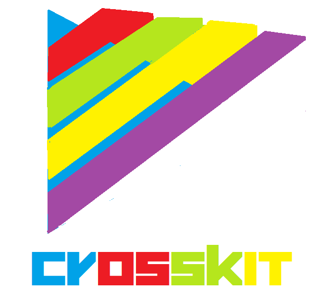

# Crosskit
Rendering Engine That Renders Graphics In CanvasRenderingContext2D,WebGLRenderingContext,SVG,And DOM



## Renderers(Rendering Modes)
1. `CANVAS`,Runs On `CanvasRenderingContext2D`
2. `WEBGL`,Runs On `WebGLRenderingContext`
3. `SVG`,Runs On SVG That Uses XML
4. `DOM`, Runs On Document Elements So It Creates `<div>` Elements With CSS Style 

## Basic Usage
Initializes Crosskit And Creates A View
```javascript
crosskit.init({
    width: 600,
    height: 600,
    renderer: SVG //Can Be Changed To DOM,CANVAS,WEBGL
});

//Then Draw A Rectangle
crosskit.rect({
    x: 100,
    y: 100,
    width: 100,
    height: 100,
    fill: "blue",
    stroke: "black"
});
```
And If You Changed Renderer In renderer Parameter To Any Of The 4 Graphics Renderers Then It Will Be The Same Appears With Some Minor Change If It Found

## Features
- Lightweight And Simple With Size Of 70kb
- 4 Rendering Modes: CANVAS,WEBGL,SVG,DOM
- Easy To Switch Between Modes
- Same Code And Same Base Without Changes When Changing Modes
- Easy To Extend And Mod
- Easy To Create Animations And Updates In Code,So Developing Games,Sketches,And Animations  With It Is Simple

## Special Thanks
1. [Corban Brook](http://twitter.com/corban),[Bobby Richter](http://twitter.com/secretrobotron),And [Charles J. Cliffe](http://twitter.com/ccliffe) At Game Closure For Developing [WebGL-2D](https://github.com/gameclosure/webgl-2d)
2. [Youn Lok](https://github.com/younlok),For Supporting Me While Developing Crosskit
3. Everyone Used Crosskit,And Everyone Contributed To It,And Supported It's Development

## More
1. [Getting Started With Crosskit](https://github.com/Rabios/Crosskit/blob/master/getting_started.md)
2. [API Functions Reference](https://github.com/Rabios/Crosskit/blob/master/crosskit_api.md)
3. [Changelog And Updates History](https://github.com/Rabios/Crosskit/blob/master/changelog.md)	
