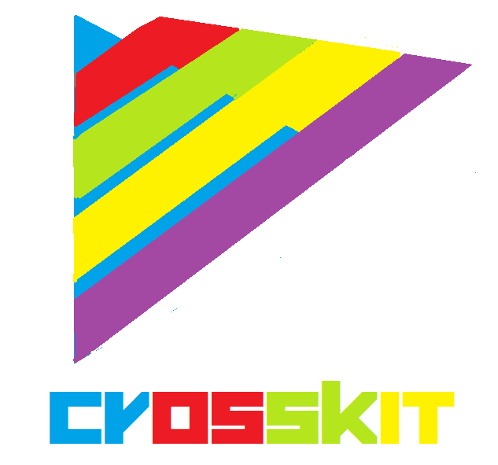

# Crosskit
Rendering engine that can renders graphics in CanvasRenderingContext2D,WebGLRenderingContext,SVG,DOM

<div align="center">
    
</div>

## Renderers(Rendering modes)
1. `CANVAS`,Runs on `CanvasRenderingContext2D`
2. `WEBGL`,Runs on `WebGLRenderingContext`
3. `SVG`,Runs on SVG that uses XML
4. `DOM`, Runs on document elements so it creates `<div>` elements with CSS style 

## Basic usage
Initializes Crosskit and creates a view
```javascript
crosskit.init({
    width: 600,
    height: 600,
    renderer: SVG //Can changed to DOM,CANVAS,WEBGL
});

//Then draw a rectangle
crosskit.rect({
    x: 100,
    y: 100,
    width: 100,
    height: 100,
    fill: "blue",
    stroke: "black"
});
```
if you changed renderer in renderer parameter to any of the 4 graphics renderers then it will be the same appears (With some minor changes if found)

## Features
- Lightweight and simple with size of 75kb (Smaller than [Two.js](https://two.js.org) and [Hilo](https://hiloteam.github.io))
- Minimifed version in size of 40kb
- 4 Renderers: CANVAS,WEBGL,SVG,DOM
- Easy,Fast to switch between renderers
- Same code,Same Base without changes when switching between renderers
- Easy to mod and extend
- Easy to create animations and updates in code,Developing games,And even creating sketches and animations as it's simple
- Great performance with backward compatibility for it's oldest versions
- Works in all weak browsers,even who doesn't support ES6
- Developed with care,All functions tested in each renderer
- Portable and easy to setup everywhere,Zero dependency,no additions needed to install

## Special Thanks
1. [Corban Brook](http://twitter.com/corban),[Bobby Richter](http://twitter.com/secretrobotron),And [Charles J. Cliffe](http://twitter.com/ccliffe) At Game Closure for developing [WebGL-2D](https://github.com/gameclosure/webgl-2d)
2. [Youn Lok](https://github.com/younlok),For supporting and cheering me while developing Crosskit
3. Everyone used Crosskit,And everyone contributed to it,And supported it's development

## More
1. [Getting started with Crosskit](https://github.com/Rabios/Crosskit/blob/master/getting_started.md)
2. [API Reference](https://github.com/Rabios/Crosskit/blob/master/crosskit_api.md)
3. [Changelog](https://github.com/Rabios/Crosskit/blob/master/changelog.md)	
4. [Controlling shapes drawn by Crosskit renderers](https://github.com/Rabios/Crosskit/blob/master/controlling_shapes_directly.md)
